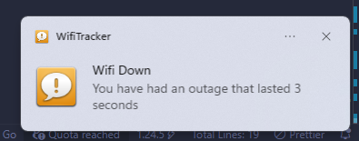

# WifiTracker 🛜
---

`WifiTracker` is a cross-platform downtime checking software that stores downtimes inside of log files.




## Installation & Usage

### From Source
```bash
git clone https://github.com/mileaage/WifiTracker
cd WifiTracker
go run main.go
```
## Contributing

Contributions are welcome! Here are some ways you can help:

### Getting Started
1. Fork the repository
2. Clone your fork: `git clone https://github.com/yourusername/WifiTracker`
3. Create a feature branch: `git checkout -b feature-name`
4. Make your changes
5. Test your changes: `go run main.go`
6. Commit and push: `git commit -m "Add feature" && git push origin feature-name`
7. Open a Pull Request

### What to Contribute
- Bug fixes
- New features (logging formats, notification methods, etc.)
- Documentation improvements
- Tests

### Guidelines
- Keep changes focused
- Test your changes before submitting
- Update documentation if needed
- Follow existing code style

### Issues
Found a bug or have an idea? [Open an issue](https://github.com/mileaage/WifiTracker/issues) first to discuss it!